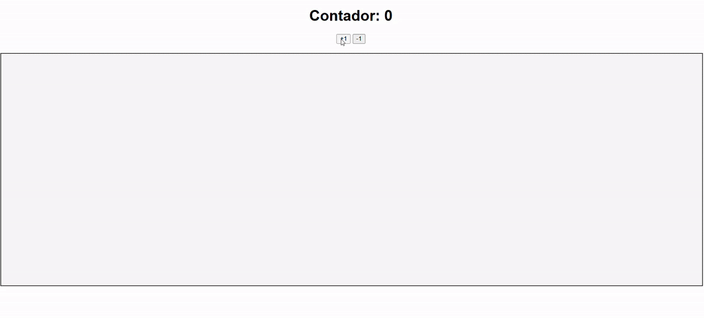

# 🟢🔴 Contador de Bolinhas | Ball Counter | Kugelzähler

[🌐 Live Demo](https://contador-de-bolinhas.web.app)

---

<details>
<summary>🇧🇷 Português</summary>

### 📖 Sobre

**Contador de Bolinhas** é uma aplicação divertida em **HTML, CSS e JavaScript** com integração em tempo real via **WebSocket** e **Redis**.  
O contador no topo controla quantas bolinhas aparecem no contêiner abaixo:

- ✅ Positivas → bolinhas **verdes**
- ❌ Negativas → bolinhas **vermelhas**

### 🚀 Funcionalidades

- 📊 Contador exibido no topo
- ➕ Um botão “+” e um botão “–”
- 🎨 Bolinhas verdes (positivo) ou vermelhas (negativo)
- 🔄 Atualizações em tempo real via WebSocket + Redis
- ☁️ Frontend hospedado no **Firebase Hosting**
- ⚙️ Backend hospedado no **Render**

### 🛠️ Tecnologias

**Frontend**: HTML5, CSS3, JavaScript, Firebase Hosting  
**Backend**: WebSocket, Redis, Render

### ⚡ Nota sobre Latência

O backend no Render pode “adormecer” após algum tempo inativo.  
Nos primeiros segundos pode haver **latência**, mas em menos de **1 minuto** a conexão se estabiliza.

### 📦 Como Executar Localmente

```bash
git clone https://github.com/joycenick/back-contador-bolinha.git
cd contador-de-bolinhas
# Abra o index.html no navegador
```

### 🌐 Deploy Atual

- **Frontend:** [contador-de-bolinhas.web.app](https://contador-de-bolinhas.web.app)
- **Backend:** hospedado no Render (pode ter latência inicial)

### 📸 Demonstração



</details>

---

<details>
<summary>🇺🇸 English</summary>

### 📖 About

**Ball Counter** is a fun **HTML, CSS, and JavaScript** app with real-time integration via **WebSocket** and **Redis**.  
The counter at the top controls how many balls appear in the container below:

- ✅ Positive → **green** balls
- ❌ Negative → **red** balls

### 🚀 Features

- 📊 Counter displayed at the top
- ➕ One “+” button and one “–” button
- 🎨 Green balls (positive) or red balls (negative)
- 🔄 Real-time updates via WebSocket + Redis
- ☁️ Frontend hosted on **Firebase Hosting**
- ⚙️ Backend hosted on **Render**

### 🛠️ Technologies

**Frontend**: HTML5, CSS3, JavaScript, Firebase Hosting  
**Backend**: WebSocket, Redis, Render

### ⚡ Latency Note

The backend on Render may “sleep” after being idle.  
During the first seconds, there may be **latency**, but within **1 minute** the connection stabilizes.

### 📦 Run Locally

```bash
git clone https://github.com/joycenick/back-contador-bolinha.git
cd contador-de-bolinhas
# Open index.html in your browser
```

### 🌐 Current Deploy

- **Frontend:** [contador-de-bolinhas.web.app](https://contador-de-bolinhas.web.app)
- **Backend:** hosted on Render (might have initial latency)

### 📸 Demo


</details>

---

<details>
<summary>🇩🇪 Deutsch</summary>

### 📖 Über

**Kugelzähler** ist eine kleine App in **HTML, CSS und JavaScript** mit Echtzeit-Integration über **WebSocket** und **Redis**.  
Der Zähler oben bestimmt, wie viele Kugeln im Container unten erscheinen:

- ✅ Positiv → **grüne** Kugeln
- ❌ Negativ → **rote** Kugeln

### 🚀 Funktionen

- 📊 Zähleranzeige oben
- ➕ Ein „+“-Button und ein „–“-Button
- 🎨 Grüne Kugeln (positiv) oder rote Kugeln (negativ)
- 🔄 Echtzeit-Updates über WebSocket + Redis
- ☁️ Frontend gehostet mit **Firebase Hosting**
- ⚙️ Backend gehostet auf **Render**

### 🛠️ Technologien

**Frontend**: HTML5, CSS3, JavaScript, Firebase Hosting  
**Backend**: WebSocket, Redis, Render

### ⚡ Hinweis zur Latenz

Das Backend auf Render kann nach längerer Inaktivität „einschlafen“.  
In den ersten Sekunden kann es zu **Latenz** kommen, aber innerhalb von **1 Minute** stabilisiert sich die Verbindung.

### 📦 Lokal Ausführen

```bash
git clone https://github.com/joycenick/back-contador-bolinha.git
cd contador-de-bolinhas
# Öffne index.html im Browser
```

### 🌐 Aktuelles Deployment

- **Frontend:** [contador-de-bolinhas.web.app](https://contador-de-bolinhas.web.app)
- **Backend:** gehostet auf Render (evtl. anfängliche Latenz)

### 📸 Demo


</details>
